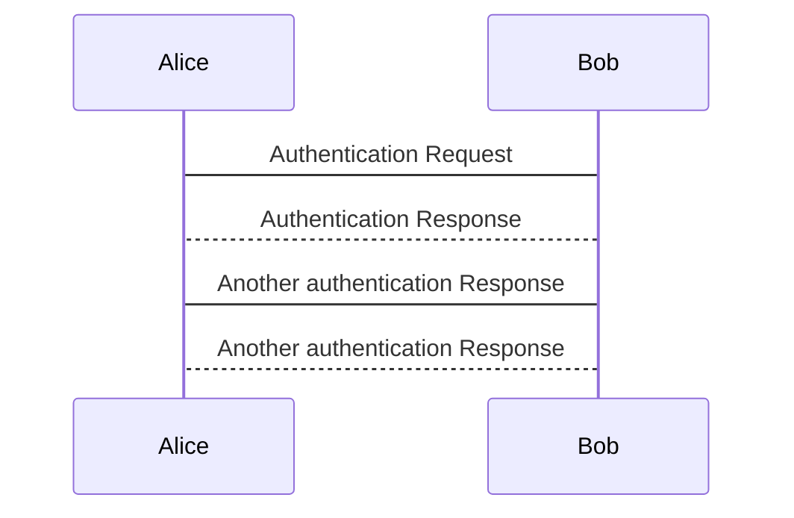

# Timetables

## TimetableFrame

A set of timetable data (VEHICLE JOURNEYs, etc.) to which the same VALIDITY CONDITIONs have been assigned. 
A TIMETABLE FRAME holds a coherent set of timetable related elements for data exchange. 
The primary component exchanged by a TIMETABLE FRAME in NeTEx / Transmodel terms is the VEHICLE JOURNEY. The Swiss profile only uses the more specific SERVICE JOURNEY (which describes an individual journey) and the TEMPLATE SERVICE JOURNEY (which describes a set of journeys repeating at a certain frequency). 

The `TimeTableFrame` contains the following allowed elements:
* `ServiceJourney` and `TemplateServiceJourney`
  * `TemplateServiceJourney` is only used for frequency traffic
  * We only model journeys that are available for passenger  
* `TrainNumber`
  * Each (TEMPLATE) SERVICE JOURNEY is mapped one-to-one to exactly one TRAIN NUMBER
* `PassingTime`s describe the times of vehicles at points in their journey
* `InterchangeRule`s describe interchanges between journeys
* `JourneyMeeting`s and `JourneyPart`s describe multipart journeys which join and split **TODO**
* `ServiceFacilitySet`s describe the various services and facilities offered by the vehicles of a journey

[//]: # (TODO: Add TimetableFrame links)
- [General NeTEx definition ](generated/xcore/TimetableFrame.html)
- [Swiss profile NeTEx definition](generated/markdown-examples/TimetableFrame.md)
- [Example snippet](generated/xml-snippets/TimetableFrame.xml)

> [Template](../templates/TimetableFrame.xml)

## ServiceJourney

A SERVICE JOURNEY is a VEHICLE JOURNEY on which passengers will be allowed to board or alight from vehicles at stops. It describes the service between an origin and a destination, as advertised to the public.

[//]: # (TODO: Add ServiceJourney links)
- [General NeTEx definition ](generated/xcore/ServiceJourney.html)
- [Swiss profile NeTEx definition](generated/markdown-examples/ServiceJourney.md)
- [Example snippet](generated/xml-snippets/ServiceJourney.xml)

> [Template](../templates/ServiceJourney.xml)

The following restrictions occur:
* The attributs id, version and responsibilitySetRef must be set.
* The validityConditions contain only one AvailablityCondition that contains only the elements FromDate, ToDate and ValidDayBits.
* In the keyList a KeyValue pair with the Key `sjyid` must exists. The Value contains a valid Swiss Journey ID.
* privateCodes: tbd
* TransportMode: tbd
* TypeOfProductCategoryRef: tbd
* TypeOfServiceRef is always set to tbd
* noticeAssignments contain all notices. Attention: they may be restricted to a given set of stops.
* ServiceAlteration is set.
* DepartureTime:
* DepartureDayOffset:
* LineRef is mandatory.
* DirectionType is only inbound or outbound
* trainNumbers contains at least one TrainNumberRef. TrainNumber i not allowed in it.
* Destination: xxx
* passingTimes: ddd
* calls are not to be used.

## TemplateServiceJourney

A TEMPLATE SERVICE JOURNEY is a (repeating) VEHICLE JOURNEY on which passengers will be allowed to board or alight from vehicles at stops. It describes the service between an origin and a destination, as advertised to the public. Only to be used if a frequency has been specified for the JOURNEY. 

[//]: # (TODO: Add TemplateServiceJourney links)
- [General NeTEx definition ](generated/xcore/TemplateServiceJourney.html)
- [Swiss profile NeTEx definition](generated/markdown-examples/TemplateServiceJourney.md)
- [Example snippet](generated/xml-snippets/TemplateServiceJourney.xml)

## AvailabilityCondition

[//]: # (TODO: Add AvailabilityCondition links)
- [General NeTEx definition ](generated/xcore/AvailabilityCondition.html)
- [Swiss profile NeTEx definition](generated/markdown-examples/AvailabilityCondition.md)
- [Example snippet](generated/xml-snippets/AvailabilityCondition.xml)

> [Template](../templates/AvailabilityCondition.xml)

## Timeband

[//]: # (TODO: Add Timeband links)
- [General NeTEx definition ](generated/xcore/Timeband.html)
- [Swiss profile NeTEx definition](generated/markdown-examples/Timeband.md)
- [Example snippet](generated/xml-snippets/Timeband.xml)

> [Template](../templates/Timeband.xml)

## NoticeAssignment

[//]: # (TODO: Add NoticeAssignment links)
- [General NeTEx definition ](generated/xcore/NoticeAssignment.html)
- [Swiss profile NeTEx definition](generated/markdown-examples/NoticeAssignment.md)
- [Example snippet](generated/xml-snippets/NoticeAssignment.xml)

> [Template](../templates/NoticeAssignment.xml)

## OccupancyView

[//]: # (TODO: Add OccupancyView links)
- [General NeTEx definition ](generated/xcore/OccupancyView.html)
- [Swiss profile NeTEx definition](generated/markdown-examples/OccupancyView.md)
- [Example snippet](generated/xml-snippets/OccupancyView.xml)

> [Template](../templates/OccupancyView.xml)

## TrainNumber

[//]: # (TODO: Add TrainNumber links)
- [General NeTEx definition ](generated/xcore/TrainNumber.html)
- [Swiss profile NeTEx definition](generated/markdown-examples/TrainNumber.md)
- [Example snippet](generated/xml-snippets/TrainNumber.xml)

> [Template](../templates/TrainNumber.xml)

## TimetabledPassingTime

[//]: # (TODO: Add TimetabledPassingTime links)
- [General NeTEx definition ](generated/xcore/TimetabledPassingTime.html)
- [Swiss profile NeTEx definition](generated/markdown-examples/TimetabledPassingTime.md)
- [Example snippet](generated/xml-snippets/TimetabledPassingTime.xml)

> [Template](../templates/TimetabledPassingTime.xml)

## ServiceFacilitySet

[//]: # (TODO: Add ServiceFacilitySet links)
- [General NeTEx definition ](generated/xcore/ServiceFacilitySet.html)
- [Swiss profile NeTEx definition](generated/markdown-examples/ServiceFacilitySet.md)
- [Example snippet](generated/xml-snippets/ServiceFacilitySet.xml)

> [Template](../templates/ServiceFacilitySet.xml)

## JourneyMeeting
tbd

[//]: # (TODO: Add JourneyMeeting links)
- [General NeTEx definition ](generated/xcore/JourneyMeeting.html)
- [Swiss profile NeTEx definition](generated/markdown-examples/JourneyMeeting.md)
- [Example snippet](generated/xml-snippets/JourneyMeeting.xml)

> [Template](../templates/JourneyMeeting.xml)

## InterchangeRule
tbd
